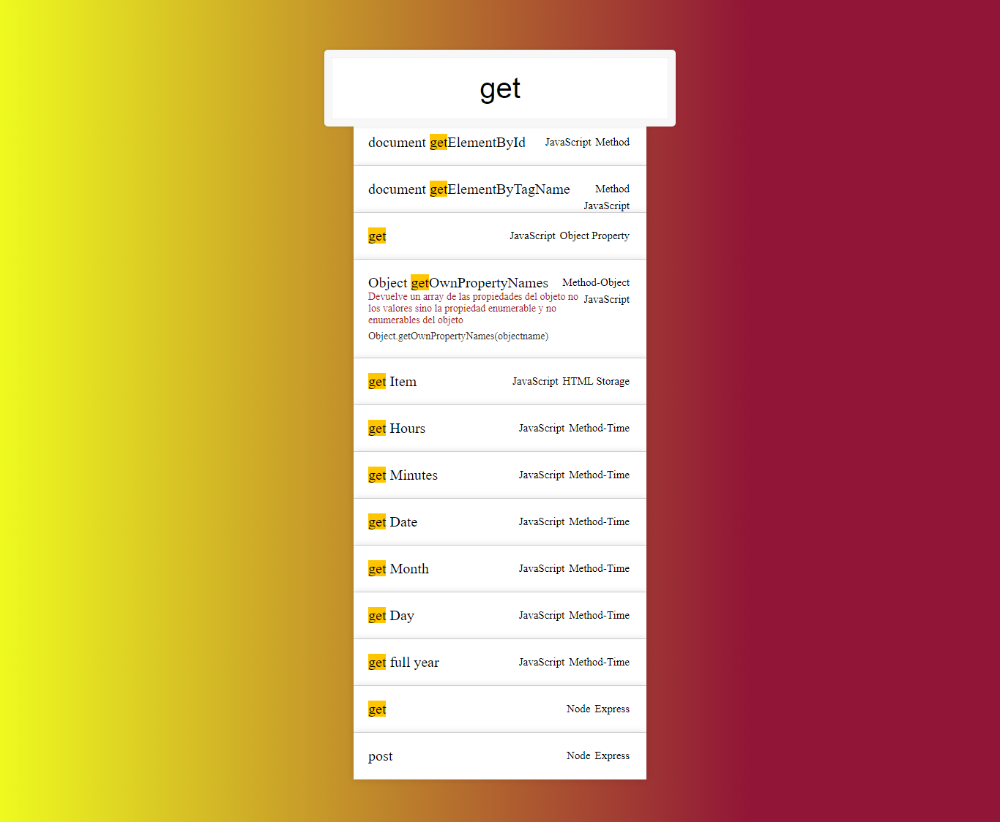

# My-Code-Notes
## My code notes with an autocomplete search bar
This is a desktop notes app build with electron that not use a database to store data, instead use a JSON file that store the notes rewriting the file in every new entry.

Additional description about the project and its features.

## Built With

- Electron.js
- Node
- Css

### Prerequisites

- Node
- Download the code from repository (https://github.com/Alexoid1/My-Code-Notes)

## Getting Started

To get a local copy up and running follow these simple example steps:

- Go to https://github.com/Alexoid1/My-Code-Notes and clone the repo using:  
`https://github.com/Alexoid1/My-Code-Notes.git` in your terminal.
- Cd ./My-Code-Notes
- Run `npm i` in your terminal.
- Run `npm run make` in your terminal.
- Cd /out/make/squirrel.['system']
- Run  Setup.exe

## Article

- Article -: [Build a quick and easy desktop app with Electron](https://alex-zam.medium.com/build-your-desktop-app-quick-and-easy-with-electron-123ae7190559)

## Author

👤 **Pablo Alexis Zambrano Coral**

- Github: [@Alexoid1](https://github.com/Alexoid1)
- Twitter: [@pablo_acz](https://twitter.com/pablo_acz)
- Linkedin: [linkedin](https://www.linkedin.com/in/pablo-alexis-zambrano-coral-7a614a189/)

## Show your support

Give a ⭐️ if you like this project!

## 📝 License

This project is [MIT](LICENSE) licensed.#
